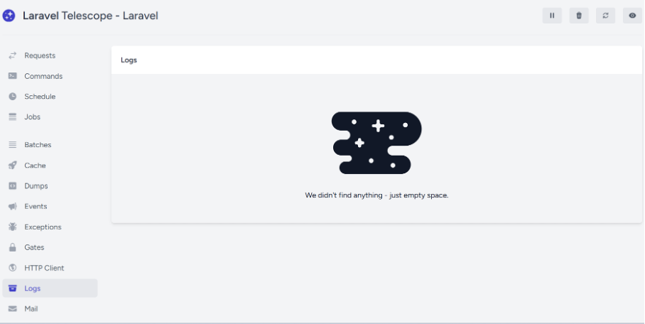
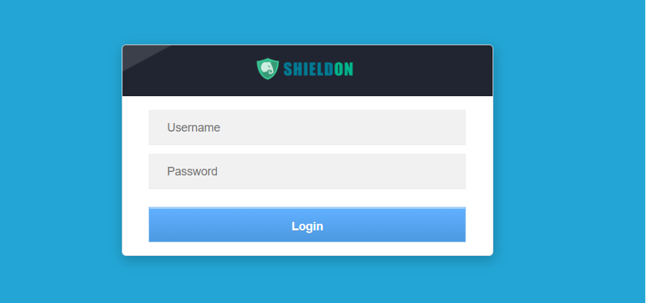

#	Registro y Monitoreo Insuficiente

## ¿Qué es el registro y monitoreo insuficiente en Laravel?

El registro y monitoreo insuficiente en Laravel se refiere a la falta de implementación o configuración adecuada de mecanismos para registrar eventos importantes y monitorear la actividad de una aplicación Laravel. Esto incluye la falta de registro de errores, intentos de acceso fallidos, cambios en datos críticos, o cualquier otra actividad que pueda indicar un comportamiento sospechoso o un ataque en curso.

## Impacto del registro y monitoreo insuficiente

La falta de registro y monitoreo adecuado puede tener graves consecuencias para una aplicación Laravel, incluyendo:

- Dificultad para detectar y responder a incidentes de seguridad: Si no se registran eventos importantes, como intentos de acceso fallidos o cambios no autorizados en datos, puede ser difícil detectar ataques o intrusiones en la aplicación. Esto puede retrasar la respuesta a incidentes y permitir que los atacantes causen más daño.
- Falta de visibilidad sobre el comportamiento de la aplicación: Sin un monitoreo adecuado, es difícil comprender cómo se está utilizando la aplicación, identificar patrones de uso inusuales o detectar posibles problemas de rendimiento.
- Incumplimiento de regulaciones: Algunas regulaciones, como el GDPR, pueden requerir que las organizaciones mantengan registros de ciertas actividades relacionadas con el procesamiento de datos personales. El incumplimiento de estas regulaciones puede resultar en multas y sanciones.
- Dificultad para solucionar problemas: Si no se registran los errores y excepciones de la aplicación, puede ser difícil identificar y corregir problemas, lo que puede afectar la estabilidad y la disponibilidad de la aplicación.

## ¿Cómo ocurre el registro y monitoreo insuficiente en Laravel?

El registro y monitoreo insuficiente puede ocurrir debido a varios factores:

- Configuración predeterminada: Laravel proporciona algunas opciones de registro predeterminadas, pero pueden no ser suficientes para todas las aplicaciones. Es importante revisar y ajustar la configuración de registro según las necesidades específicas de la aplicación.
- Falta de conocimiento: Los desarrolladores pueden no estar familiarizados con las mejores prácticas de registro y monitoreo o pueden pasar por alto la importancia de estos mecanismos.
- Complejidad de la aplicación: A medida que las aplicaciones crecen en complejidad, puede ser más difícil implementar un registro y monitoreo efectivos que cubran todos los aspectos críticos de la aplicación.
- Recursos limitados: En algunos casos, las limitaciones de recursos, como el espacio de almacenamiento o la capacidad de procesamiento, pueden llevar a decisiones de no registrar o monitorear ciertos eventos.

## Mitigación de registro y monitoreo insuficiente

Laravel proporciona varias herramientas y prácticas recomendadas para mejorar el registro y monitoreo de una aplicación ([ver documentación oficial Laravel Logging](https://laravel.com/docs/11.x/logging)):

- Sistema de registro de Laravel:

Laravel utiliza Monolog, una biblioteca de registro flexible, para registrar eventos en diferentes canales (archivos, base de datos, Slack, etc.). Se puede personalizar los canales y niveles de registro según las necesidades.

- Registro de eventos importantes:

Registrar eventos clave relacionados con la seguridad, como:
    - Inicios de sesión exitosos y fallidos.
    - Cambios en datos sensibles (actualización de información de perfil, cambio de contraseña)
    - Errores críticos de la aplicación
    - Intentos de acceso no autorizado

- Niveles de registro adecuados:

Utilizar los niveles de registro de Monolog (debug, info, notice, warning, error, critical, alert, emergency) para clasificar la gravedad de los eventos y facilitar el filtrado y análisis.

- Monitorea los registros en tiempo real:

Utilizar herramientas de monitoreo de registros para visualizar y analizar los registros en tiempo real. Laravel Telescope permite detectar anomalías o comportamientos sospechosos de manera temprana ([ver documentación oficial Laravel Telescope](https://laravel.com/docs/11.x/telescope)).

```bash
# terminal

composer require laravel/telescope --dev
php artisan telescope:install
php artisan migrate

```



- Protección mediante Web Application Firewall WAF:

Configurar alertas para recibir notificaciones inmediatas cuando ocurran eventos críticos, como intentos de acceso no autorizado o errores graves en la aplicación mediante un WAF. Una de las opciones mas utilizadas es ShieldOn, un WAF muy utilizado por la comunidad de PHP y sus diferentes frameworks ([ver documentación oficial Shield On](https://shieldon.io/en/guide/laravel.html)). Laravel puede utilizar ShieldOn mediante la siguiente instalación:

```bash
#. terminal

composer require shieldon/shieldon

```

Previa la instalación hay que agregar las siguientes líneas al inicio del archivo de inicio de Laravel bootstrap/app.php:

```php
# app.php

if (isset($_SERVER['REQUEST_URI'])) {

    $storage = __DIR__ . '/../storage/shieldon_firewall';
    $firewall = new \Shieldon\Firewall\Firewall;

    $firewall->configure($storage);
    $firewall->controlPanel('/firewall/panel/');

    $response = $firewall->run();

    if ($response->getStatusCode() !== 200) {
        $httpResolver = new \Shieldon\Firewall\HttpResolver;
        $httpResolver($response); 1 
    }
}

```

Para poder visualizar el entorne de ShieldOn en la Aplicación web se debe configurar la ruta de acceso en el archivo de rutas web de Laravel routes/web.php:

```php
# web.php

use Shieldon\Firewall\Panel;

Route::any('/firewall/panel/{path?}', function () {
    $panel = new Panel;
    $panel->csrf([ '_token' => csrf_token() ]); 
    $panel->entry(); 
})->where('path', '(.*)');

```
En el sitio web de la aplicación web se debe acceder a la ruta firewall/panel mediante las credenciales por defecto usuario: shieldon_user y la contraseña shieldon_pass:



ShieldOn permite configurar el WAF de manera completa incluyendo notificación de seguridad mediante diferentes Web Services gratuitos, como: Telegram, Line Notify, SMTP, o plataformas de pago, como: Slack, Rocket Chat, etc.
