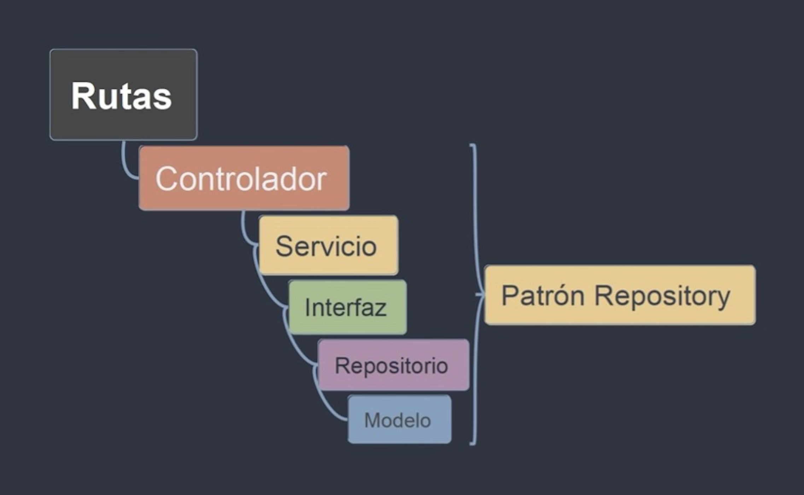

# Diseño inseguro

## ¿Qué es el diseño inseguro?

El diseño inseguro se refiere a cualquier decisión o práctica de diseño en la arquitectura o implementación de una aplicación Laravel que introduce vulnerabilidades de seguridad o aumenta el riesgo de ataques. Aunque Laravel proporciona un marco sólido para el desarrollo de aplicaciones web, un diseño inseguro puede socavar sus características de seguridad integradas y exponer la aplicación a diversas amenazas.

## Impacto del diseño inseguro

Un diseño inseguro puede tener graves consecuencias para una aplicación Laravel, incluyendo:

- Vulnerabilidades de seguridad: Un diseño inseguro puede introducir vulnerabilidades como SQLi, XSS, CSRF, exposición de datos sensibles y otras, que los atacantes pueden explotar para comprometer la seguridad de la aplicación y los datos de los usuarios.
- Acceso no autorizado: Un diseño deficiente puede permitir a los atacantes eludir los mecanismos de autenticación y autorización, obteniendo acceso a áreas restringidas de la aplicación o a datos confidenciales.
- Lógica de negocio vulnerable: Un diseño inseguro puede resultar en una lógica de negocio vulnerable que los atacantes pueden manipular para realizar acciones no autorizadas y obtener beneficios indebidos.
- Problemas de escalabilidad y rendimiento: Un diseño deficiente puede afectar negativamente el rendimiento y la escalabilidad de la aplicación, haciéndola más susceptible a ataques de denegación de servicio (DoS).

## ¿Cómo ocurre el diseño inseguro en Laravel?

El diseño inseguro puede ocurrir debido a varios factores:

- Falta de conocimiento de las mejores prácticas de seguridad: Los desarrolladores pueden no estar familiarizados con las mejores prácticas de diseño seguro o pueden pasar por alto consideraciones de seguridad importantes durante el desarrollo.
- Priorización de la funcionalidad sobre la seguridad: En algunos casos, la presión para entregar funcionalidades rápidamente puede llevar a sacrificar la seguridad en el diseño de la aplicación.
- Complejidad de la aplicación: Las aplicaciones grandes y complejas pueden ser más difíciles de diseñar de forma segura, ya que hay más interacciones y dependencias que considerar.
- Falta de revisión y pruebas de seguridad: No realizar revisiones de código exhaustivas ni pruebas de seguridad durante el desarrollo puede dejar vulnerabilidades ocultas en el diseño de la aplicación.

## Mitigación de diseño inseguro

Laravel utiliza el patrón Modelo-Vista-Controlador (MVC), pero no impone una estructura rígida sobre su diseño, por tal motivo, la mejora en la seguridad de su diseño radica en la implementación del patrón repositorio (Repository Pattern). Una implementación de este patrón implica:

- Controlador (Controller): Gestiona las solicitudes HTTP, delega la lógica de negocio a los servicios y devuelve las respuestas.
- Servicio (Service): Contiene la lógica de negocio de la aplicación. Interactúa con los repositorios para realizar operaciones de datos.
- Interfaz (Interface): Define un contrato para las operaciones de datos que el repositorio debe implementar.
- Repositorio (Repository): Implementa la interfaz y proporciona métodos para acceder y manipular los datos del modelo.
- Modelo (Model): Representa la estructura de los datos y, a menudo, interactúa directamente con la base de datos a través de Eloquent ORM en Laravel.



Su flujo de trabajo se establece de la siguiente manera:

1.	El controlador recibe una solicitud HTTP.
2.	El controlador invoca los métodos del servicio para manejar la lógica de negocio.
3.	El servicio utiliza la interfaz del repositorio para realizar operaciones de datos.
4.	El repositorio implementa la interfaz e interactúa con el modelo para acceder a la base de datos.
5.	El modelo realiza las operaciones de base de datos necesarias y devuelve los resultados al repositorio.
6.	El repositorio devuelve los datos al servicio.
7.	El servicio procesa los datos y los devuelve al controlador.
8.	El controlador devuelve una respuesta HTTP al cliente.

```php
# UserInterface.php

namespace App\Repositories\Contracts;

use App\Models\User;
use Illuminate\Database\Eloquent\Collection;

interface UserInterface
{
    public function all(): Collection;
    public function find(int $id): ?User;
    public function create(array $data): User;
    public function update(array $data, int $id): bool;
    public function delete(int $id): bool;
}

```

```php
# UserRepository.php

namespace App\Repositories;

use App\Models\User;
use App\Repositories\Contracts\UserInterface;
use Illuminate\Database\Eloquent\Collection;

class UserRepository implements UserInterface
{
    public function all(): Collection
    {
        return User::all();
    }

    public function find(int $id): ?User
    {
        return User::findOrFail($id);
    }

    public function create(array $data): User
    {
        return User::create($data);
    }

    public function update(array $data, int $id): bool
    {
        $user = $this->find($id);
        $user->fill($data);
        return $user->saveOrFail();
    }

    public function delete(int $id): bool
    {
        $user = $this->find($id);
        return $user->deleteOrFail();
    }
}

```

```php
# UserService.php

namespace App\Services;

use App\Models\User;
use App\Repositories\Contracts\UserInterface;
use Illuminate\Database\Eloquent\Collection;

class UserService
{
    protected UserInterface $user;

    public function __construct(UserInterface $user)
    {
        $this->user = $user;
    }

    public function getAllUsers(): Collection
    {
        return $this->user->all();
    }

    public function getUserById(int $id): ?User
    {
        return $this->user->find($id);
    }

    public function createUser(array $data): User
    {
        return $this->user->create($data);
    }

    public function updateUser(array $data, int $id): bool
    {
        return $this->user->update($data, $id);
    }

    public function deleteUser(int $id): bool
    {
        return $this->user->delete($id);
    }
}

```

```php
# UserController.php

namespace App\Http\Controllers;

use App\Services\UserService;
use Illuminate\Http\Request;

class UserController extends Controller
{
    protected UserService $user;

    public function __construct(UserService $user)
    {
        $this->user = $user;
    }

    public function index()
    {
        $users = $this->user->getAllUsers();
        return view('users.index', ['users' => $users]);
    }

    public function show($id)
    {
        $user = $this->user->getUserById($id);
        return view('users.show', ['user' => $user]);
    }

    public function create()
    {
        return view('users.create');
    }

    public function edit($id)
    {
        $user = $this->user->getUserById($id);
        return view('users.edit', ['user' => $user]);
    }

    public function store(Request $request)
    {
        $this->user->createUser($request->all());
        return redirect('/users');
    }

    public function update(Request $request, $id)
    {
        $this->user->updateUser($request->all(), $id);
        return redirect('/users');
    }

    public function destroy($id)
    {
        $this->user->deleteUser($id);
        return redirect('/users');
    }
}

```
